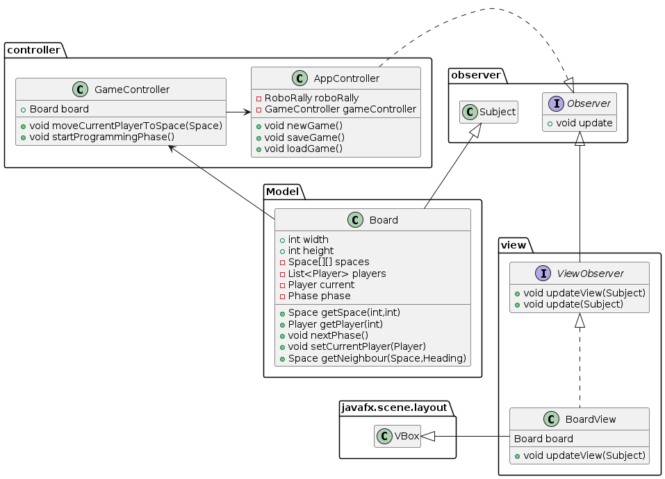
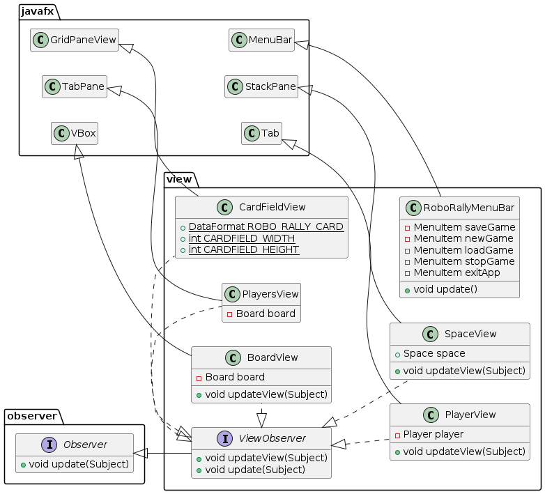
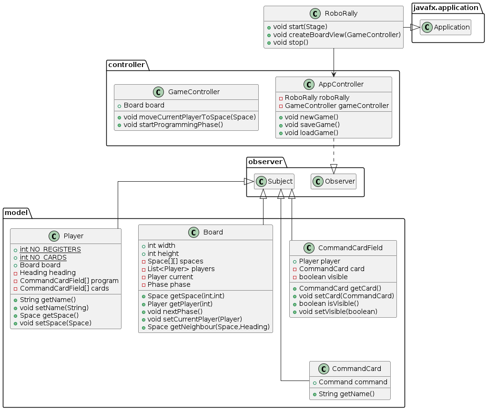
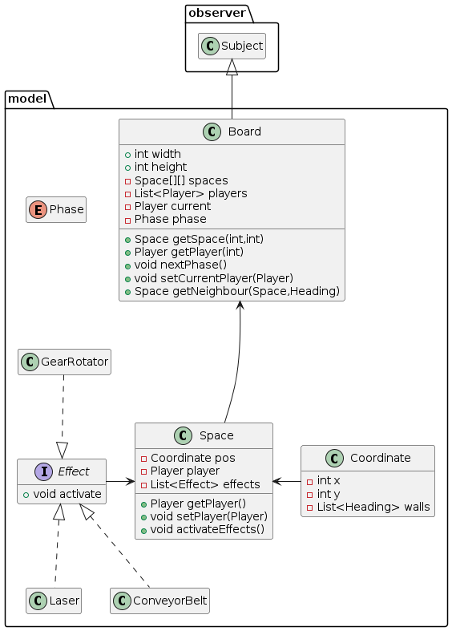

\newpage

# Functional Requirements

## Concepts, Features and Use Cases

### Concepts

The game RoboRally includes many concepts, that are hard to group accurately.
We will do out best to write out as many as possible, that cover the basic game:

1. **Robots**: The game revolves around the concept of robots moving around a field, to reach their destination as fast as possible
2. **Factory**: The game is played in a factory, which includes many sub concepts, such as **Obstacles, Conveyor Belts** and **Lasers**.
3. **Programming cards**: Each turn a player programs is made using Programming Cards. These cards predetermine the turn's outcome, and are an important concept to get right, to get the right feel of the game.
4. **Game Phases**: The game is split in different game phases, which include the **Programming Phase** and the **Movement Phase**. This is a unique part of Roborally, and is equally important to get right.

### Features

The features of a game like Roborally is a bit of an abstract concept, we have chosen some things that we consider to be the most important features of Roborally. There is some overlap between Concepts and Features, since the Concepts are implemented as Features.

1. **Game Phases**: The players are able to select their **Programming Cards** in the **Programming Phase** of the game, before these cards are then executed in the **Movement Phase**.
2. **Programming Cards**: The players will be able to program what their robot will do using cards that predetermine moves and timing.
3. **Lasers**: The Factory will include lasers on the map, which do damage to robots standing in their way. This damage will worsen the **Programming Cards** that are available by the player on the receiving end.
4. **Robot Lasers**: At the end of the **Movement Phase**, players will also shoot these lasers, in the direction they are facing.

## Use Cases

Use cases are never easy to define for a game, since the major use case is almost always just: "play the game". There are however some additional use cases to be had with Roborally.

1. Play the Game: This is always going to be the main use case for any game.
2. Save the Game: We intend to implement saving the game state in the middle of a game. This is not in itself useful, but will be utilized in another use case.
3. Load Game: This is the obvious follow-up to the previous use case.

\newpage

## Class Diagrams

Since the scale of this program is quite large, we do not believe that a single class diagram will fit all of our classes, and still be readable. Therefore, we have decided to split these into one general class diagram, and a few more specific class diagrams, for help with implementation.

### Overview

This is the structure in which our MVC classes interacts with one another. We can only see the way that the different classes related to the Board(GameBoard) interacts here, but most of the other game elements follow a similar pattern.

\newpage

### View

The view gets updated through the observer/subject, also known as observer/observable, pattern.

\newpage

### Model and Controller

When state is update in model the view is notified because all parts of the model inherits the Subject class.

\newpage

### Board

Board is a sub-package in the model package.

{height=700px}

## Activity Diagram

\newpage

# Non-Functional Requirements

## Performance {.unnumbered .unlisted}

The game should be fast and responsive, with minimal lag or delays between player actions.

## Usability {.unnumbered .unlisted}

The game interface should be intuitive and easy to use, with clear instructions and feedback for players.

## Reliability {.unnumbered .unlisted}

The game should be stable and reliable, with zero errors or crashes.

## Compatibility {.unnumbered .unlisted}

The game should be compatible with a range of operating systems, and should run smoothly on different hardware configurations.

## Scalability {.unnumbered .unlisted}

The game should be able to handle large numbers of players and game sessions, without sacrificing performance or usability.

## Maintainability {.unnumbered .unlisted}

The code should be well-structured and modular, with clear documentation and easy-to-understand logic, to make future updates and maintenance easier.

## Accessibility {.unnumbered .unlisted}

The game should be designed to be accessible to a wide range of users.

## Localization {.unnumbered .unlisted}

The game should be designed to support multiple languages and cultural contexts, to make it accessible to a global audience.
