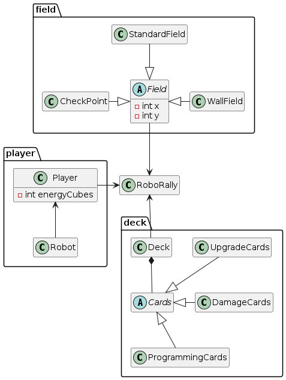

# Main documentation

## Domain Model

{width="3.535277777777778in"}

\newpage

## MoSCoW Requirement List

### Must have

The game must have the following features:

1. Saving games on the server
2. Loading games from the server
3. Player hand and cards must be saved to the correct game-board
4. Saving and loading should be implemented using JSON or a database
5. Game boards are defined by at least two JSON files.
6. One or more of the cards must be integrative
7. Impassable walls
8. At least two field actions
9. Checkpoints that you should go to win.
10. 1 to 3 other players, so it is a multiplayer game.
11. the opportunity to draw programming cards from all existing cards that are described in the rules
12. Drawing programming cards from the card stack
13. a robot can move on the board
14. play 5 programming cards in turn to plan the robot's movements
15. choose which programming cards to play
16. plan a new turn when the robots have stopped moving if the game is not finished
17. reach checkpoints to win the game
18. finish and win the game if I collect the correct number of checkpoints that are required to win the game on that
    particular board
19. visually distinguishable fields
20. draw my programming cards from the shuffled discard pile when a programming phase begins

    ### Should have

    The game should have the following features:

21. unused cards that get shuffled after the round
22. walls can not be moved through
23. push other players' robots if my robot bumps into them during the moving phase
24. Robots receive damage
25. Robots shoot a laser forward after each move, so that other players' robots get hit and take damage
26. play a damage card in my programming phase, so that I get rid of the damage card after the turn
27. be standing at a checkpoint at the end of a register, so that I get a checkpoint to my collection
28. land on a blue conveyor belt, so that my robot moves two spaces forward of the conveyor belt
29. land on a green conveyor belt, so that my robot moves one space forward of the conveyor belt
30. land on a push panel, so that my robot gets pushed to the next space in the direction the panel is facing
31. land on a gear, so that my robot turns 90 degrees in the direction of the arrow on the gear
32. get hit by lasers placed on the map, which shoot and conduct damage if hit, every cycle of the moving phase
33. take damage if moving out of bounds
34. land in a pit to take damage
35. re-spawn where I started the game, when my robot goes out of the borders, or it lands in a pit
36. visually see what is happening during a round
37. change the order of my programming cards during the programming phase if I make a mistake, or change my mind
38. my non-played programming cards, to end in my discard pile when the programming phase is over
39. take damage and place this damage card in my discard pile, so that the other players have an advantage when I take
    damage

    ### Could have

40. start a timer in the activation phase of 30 seconds, when I am done programming, so that the other players run
    out of time, and get random programming cards on their empty programming fields. this is easier to implement onliner
    than it is to do with one computer

    ### Would be nice to have

41. play with energy tokens, so that I can upgrade my robot
42. purchase upgrading cards, so that I get an advantage
43. play temporary upgrade cards before a turn, and get them removed after the turn is over
44. choose from different upgrade cards to buy
45. keep my non-temporary upgrading cards, so that they work more rounds
46. change upgrading cards, if I have more than the robot can carry
47. get one of four damage cards, when I take damage
48. if I fall into a pit, fall off the board, or activate a worm card, I must reboot my robot and take the following
    actions:
    - take two spam damage cards and place them in my discard pile,
    - cancel my programming
    - discard my programming cards (including damage cards) from the register and hand
    - and wait until the next turn to program the robot.
    - I can then place my robot on the reboot token that I started the game on and play temporary upgrading cards during
      the activation phase

## Game description

### How to play

To play Roborally... (Open in Intellij?). When the game launches, select "File" in the upper left corner, and press "New
Game". You will then be prompted to select a game board from your files. Click "OK" and select "Dizzy Highway". After
this, select the number of players when prompted. The game will then start, and you can play the game.

### Features implemented

Our Roborally game includes several key features:

- Loading a game board from a JSON file. There's a full gameboard called Dizzy Highway, containing all the space types
  that have been implemented up to this date. Furthermore, there's an empty gameboard and a test board.
- Saving a game as a JSON file
- Partly loading a saved from a JSON file. To see our thoughts on the implementation, see "Thoughts on load feature",
  later in this document.
- Several space types, such as checkpoints, both types of conveyor belts, and walls.
- Playing and drawing new cards to play on your turn.
- Finding a winner when a player has reached all checkpoints.

### Thoughts on the load feature

We started implementing the JSON serializing and deserializing on our own, and we have it is almost working, but
there are some hard-to-solve bugs. To get rid of these, we will reimplement the serde and deser and rely much more on
the
file-access package given to us by the professor. We had problems getting up and running with our classes because they
differ a bit in architecture from the one the professor supplies, but we have almost solved that, so in approximately
a week we will have the serializing perfected.

For now, much of the state works when serializing and deserializing, but when we want to deserialize the board from JSON
the subclasses of `Space` gets lost and all subtypes get turned into generic Spaces, which makes the board not very
useful. Unfortunately, we will not have time to fix this for the delivery on the 5th of May, but it is almost completed
and
will be done as soon as possible.

## Taxonomy

Substantives will be used as inspiration for our classes and fields classes, and verbs for methods

| Substantives         | Verbs       |
|----------------------|-------------|
| Gameboard            | Upgrade     |
| Start board          | Program     |
| Robot figure         | Activate    |
| priority antenna     | Purchase    |
| 30-second sand timer | Shuffle     |
| Programming cards    | Reboot      |
| Player mat           | Move        |
| Reboot tokens        | Draw        |
| Checkpoint tokens    | Turn        |
| Programming cards    | Flip        |
| Damage cards         | Fire        |
| Upgrade shop         | Push        |
| Checkpoint           | Rotate      |
| Energy bank          | Win         |
| Energy reserve       | Take damage |
|                      | Lose        |

