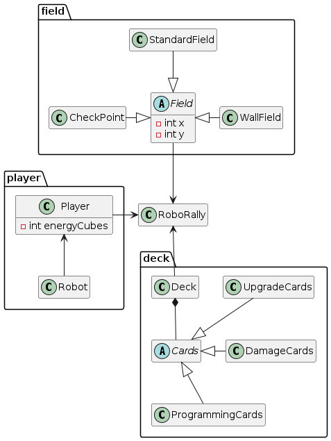

# RoboRally Taxonomy

_Group 18_

## MoSCoW Requirement List

**Must have:**

The game must have the following features:

- 1 - Play on at least one course.

- 2 - 2 to 6 players can play the game.

- 3 - Each player Can/must draw from their own programming card deck corresponding to the their chosen robot

- 4 - Play 5 programming cards in a turn to plan the robot\'s
  movements.

- 5 - Choose which programming cards to play.

- 6 - Draw new programming cards each turn.

- 7 - Robots should start at starting field.

- 8 - Robots can move on the board.

- 9 - Shop refreshes cards.

- 10 - Plan a new turn when the robots have stopped moving, if the
  game is not finished.

- 11 - Push other players robots the robot bumps into them, during the
  moving phase.

- 12 - The robots moves one programming card at a time, and then it is
  the next robot\'s turn to move.

- 13 - Take damage and place this damage card in the discard pile

- 14 - Unused cards get shuffled after the round.

- 15 - Walls can not be moved through.

- 16 - Reach checkpoints with the robot.

- 17 - Finish and win the game, if I collect the correct amount of
  checkpoints that is required to win the game on that particular
  board.

- 18 - Visually distinguishable fields

- 19 - Draw my programming cards from the shuffled discard pile, when
  a programming phase begins

**Should have:**

The game should have the following features:

- 20 - Robots receive damage

- 21 - Robots shoot a laser forward, after each move, so that other
  players robots get hit and take damage.

- 22 - Play a damage card in the programming phase.

- 23 - Robots standing on a checkpoint at the end of a register, so
  that the player gets a checkpoint to their collection.

- 24 - Landing on a blue conveyor belt moves the robot two spaces
  forward of the conveyor belt.

- 25 - Landing on a green conveyor belt moves the robot one space
  forward of the conveyor belt.

- 26 - Landing on a push panel moves the robot to the next space of
  the direction the panel is facing.

- 27 - Landing on a gear, turns the robot 90 degrees in the direction
  of the arrow on the gear.

- 28 - Robots can get hit by lasers placed on the map, and take damage
  if hit, every cycle of the moving phase.

- 29 - Robots take damage if moving out of bounds.

- 30 - Robots that land in a pit takes damage.

- 31 - Robot re-spawns where it started the game, when the robot goes
  out of bounds, or it lands in a pit.

- 32 - Players can visually see what is happening during a round.

- 33 - Players can change the order of their programming cards during
  the programming phase, if they make a mistake, or changes their
  mind.

- 34 - The non-played programming cards, ends in the discard pile when
  the programming phase is over.

**Could have**

- 35 - A timer of 30 seconds starts in the activation phase, when a
  player is done programming, so that the other players run out of
  time.

- 36 - Players gets random programming cards on their empty
  programming fields if they run out of time.

**Would be nice to have**

- 37 - Use energy tokens to upgrade robot.

- 38 - Purchase upgrade cards to upgrade robot.

- 39 - Play temporary upgrade cards before a turn, and get it removed
  after the turn.

- 40 - Choose from different upgrade cards to buy.

- 41 - Players keeps the non-temporary upgrading cards after the turn.

- 42 - Change upgrade cards, if a player has more than the robot can
  carry.

- 43 - Players get one of four damage cards, when their robot takes
  damage.

- 44 - If the robot falls into a pit, fall of the board, or activate a
  worm card, the robot must reboot and take the following actions:

  - Take two spam damage cards and place them in the players discard
    pile.

  - Cancel the players programming.

  - Discard the programming cards (including damage cards) from register and hand.

  - Wait until next turn to program the robot.

  - Place the robot on the reboot token that the robot started the game on and play temporary upgrading cards during activation phase.

## Domain Model

{width="3.535277777777778in"}
